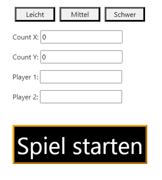

# Käsekästchen-Oberfläche

Ein Schulungsprojekt, das zum Kennenlernen mit Vue.js/Java erstellt  wurde. 
Ist eins von zwei Teilen des Projektes "kk-tournament" und dient als Oberfläche für https://github.com/4otkiyMaster/kk-tournament und lässt Benutzern das Spiel über den Browser anwenden. 

## Beschreibung

- Regeln:
Käsekästchen ist ein Spiel für zwei oder mehr Spieler.
Es hat ein rechteckiges Spielfeld, das aus mehreren quadratischen "Kästchen" aufgebaut ist.
Alle Spieler schließen nacheinander eine Wand eines Kästchens innerhalb des Feldes (Die Außenwände sind von Anfang an geschlossen).
Falls ein Spieler mit einer Wand auch ein ganzes Kästchen schließt, das keine offenen Wände mehr hat, erhält er einen weiteren Zug.
Jedes geschlossene Kästchen gibt dem Spieler einen Punkt.
Das Spiel endet, wenn alle Kästchen geschlossen sind, und der Spieler mit den meisten Punkten gewinnt.
- Funktionalität:
  - Flexible Feldgröße, die kann man selbst mit den Eingabezeilen oder Tasten anpassen
  - Drei Tasten mit vorderfinierte Feldgrößen (Leicht - 4x4, Mittel - 8x8, Schwer - 16x16)
  - Zeilen zur Eingabe der Namen der Spieler
  - Anzeige des aktuellen Spielers und der Punktzahl aller Spieler
  - Einfache Interaktion mit dem Feld durch Klicken auf die Wand für den Zug und automatische Färbung geschlossenes Kästchens in der Farbe des Spielers, der es geschlossen hat
  - Tasten "Zurücksetzen" um auf Seite mit Spieleinstellungen zurückzugehen und "Neu starten" um geschlossene Wände zu offen und das Spiel mit den gleichen Einstellungen neuzustarten
 


## Projekt installieren

1. Repositorium klonen:
```bash
 git clone https://github.com/4otkiyMaster/Kaesekaestchen.git
```

2. Abhängigkeiten installieren:
```bash
 cd Kaesekaestchen
 npm install
 ```

3. Backend installieren:

Installieren Sie Backend von https://github.com/4otkiyMaster/kk-tournament

## Projekt ausführen

1. Backend starten

2. Projekt starten:
- Entwicklungsmodus (Starten den lokalen Entwicklungsserver):
```bash
 npm run dev
 ```

- Produktionsmodus (Erstellen eine optimierte Version des Projekts, die für Produktion bereit ist):
```bash
 npm run build
 ```

## Anwendung

- Wenn es alles richtig angestellt ist, können Sie der lokalen Entwicklungsumgebung folgen. Sie sollten dann die Spieleinstellungsseite sehen:
  - Vorkonfigurationstasten - sie helfen schnell konfigurieren ihre Feldgröße
  - Eingabezeilen für die Feldgröße - manuelle Angabe der Feldbreite (Count X:) und -höhe (Count Y:)
  - Eingabezeilen für die Spieler - Angabe der Spielernamen
  - Start-Taste
- Um Spiel zu starten, müssen Sie unbedingt alle Zeilen ausfüllen und auf "Spiel starten" drücken
- Danach wird das Spielfeld angezeigt, und Sie können bereits Ihre ersten Züge machen, indem Sie auf die Wände klicken

## Recommended IDE Setup

[VSCode](https://code.visualstudio.com/) + [Volar](https://marketplace.visualstudio.com/items?itemName=Vue.volar) (and disable Vetur) + [TypeScript Vue Plugin (Volar)](https://marketplace.visualstudio.com/items?itemName=Vue.vscode-typescript-vue-plugin).
